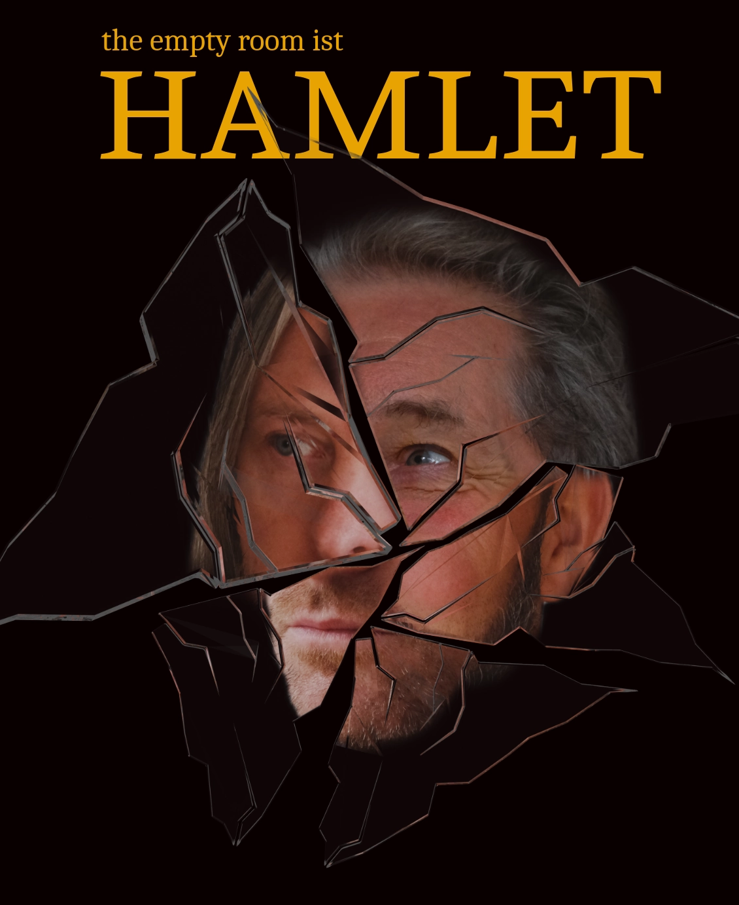

+++
+++

 

*"Die Welt ist aus den Fugen... Von dem Begräbnis das eingemachte Fleisch deckt kalt den Hochzeitstisch... Komm, setz dich! Nicht weichen sollst du, bis ich dir den Spiegel zeige, der dein Innerstes enthüllt..."*

In eigener Bühnenfassung, Spieldauer ca.100 Min.

**the empty room** ist ein freies Theaterkollektiv aus dem Süden Hamburgs. Es spielt vor minimalem Hintergrund und ohne technischen Aufwand. Ohne einen Regisseur gestalten die Spieler den Prozess der Inszenierung gemeinsam.

## Aufführungen
**Beginn: 19:30** / Einlass:19:00
- Do, 08.05. Heisenberg-Gymnasium, Triftstraße 43
- Fr, 09.05. MUT! Theater, Amandastraße 58
- Sa, 10.05. elbdeich e.V., Moorburger Elbdeich 249
- So, 11.05. Gartenkunstnetz e.V., Eifflerstraße 35
- Fr, 16.05. Heisenberg-Gymnasium, Triftstraße 43
- Sa, 17.05. Kellertheater, Johannes-Brahms-Platz 1

## Ein Blick in das Spiel

