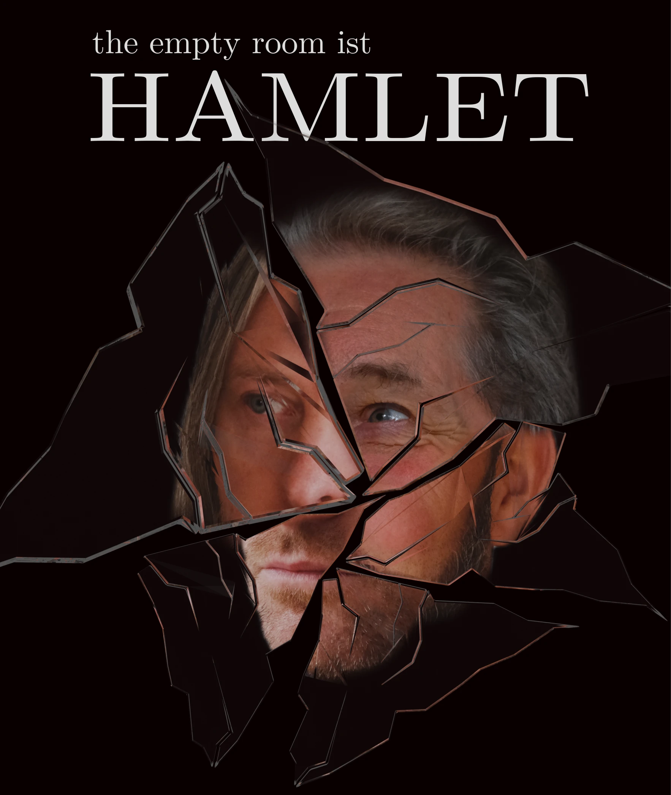
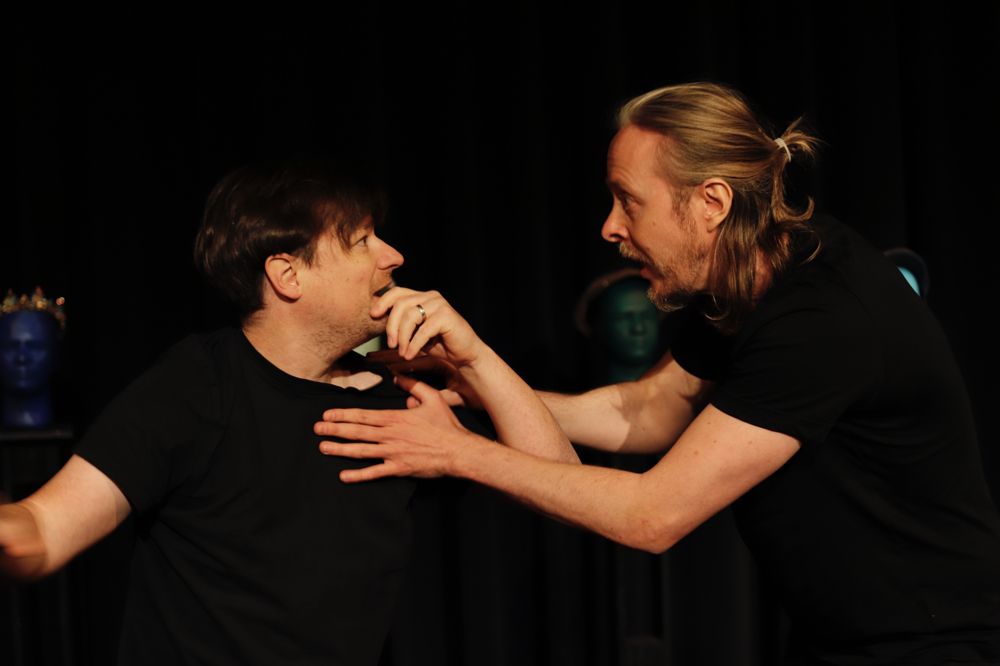
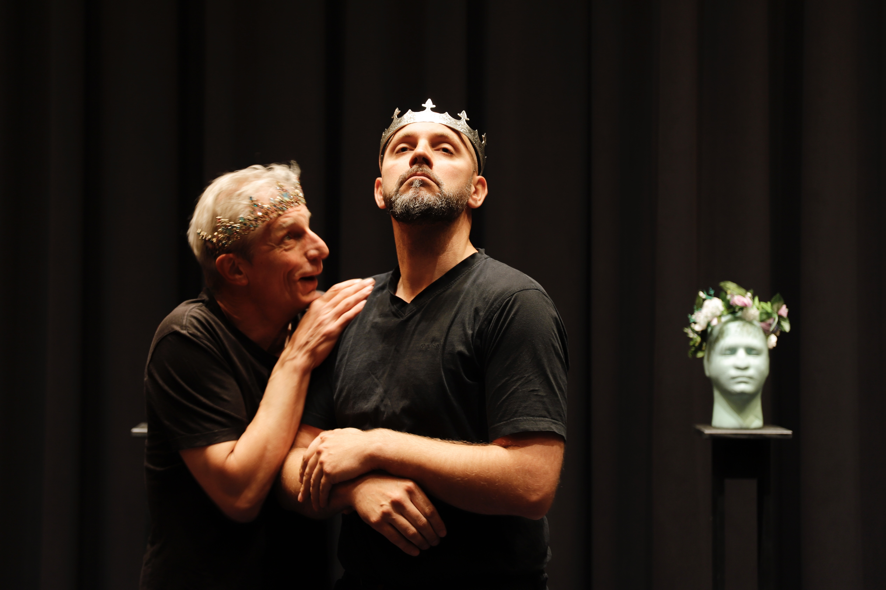
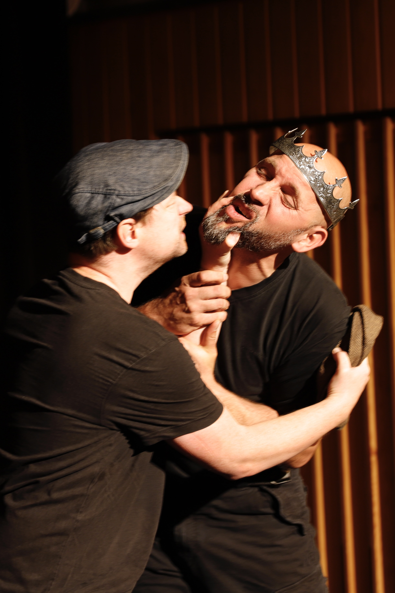

+++
+++

 

*"Die Welt ist aus den Fugen... Von dem Begräbnis das eingemachte Fleisch deckt kalt den Hochzeitstisch... Komm, setz dich! Nicht weichen sollst du, bis ich dir den Spiegel zeige, der dein Innerstes enthüllt..."*

In eigener Bühnenfassung, Spieldauer ca.100 Min.

**the empty room** ist ein freies Theaterkollektiv aus dem Süden Hamburgs. Es spielt vor minimalem Hintergrund und ohne technischen Aufwand. Ohne einen Regisseur gestalten die Spieler den Prozess der Inszenierung gemeinsam.

## Aufführungen
- Di, 22.07.25, 17:00 Uhr, Sommer im Park, Freilichtbühne im Harburger Stadtpark, Marmstorfer Weg / Außenmühle,
- So, 05.10.25, 17:00 Uhr, Alte Werft, Cranz

## Karten
- Eintritt 15€, ermäßigt 7€
- Vorbestellungen bis zum Tag vor der Aufführung per Mail: *theemptyroom@posteo.de*:
    - Name, Aufführungsdatum, Anzahl der Karten zur Resevierung.
    - Die Karten liegen bis 15 Minuten vor Aufführungsbeginn an der Abendkasse bereit.

## Ein Blick in das Spiel

